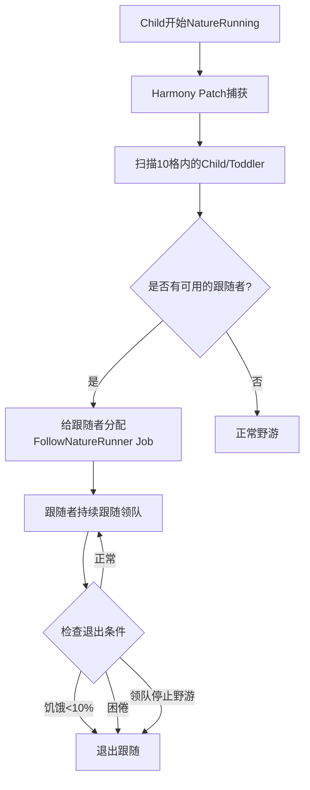
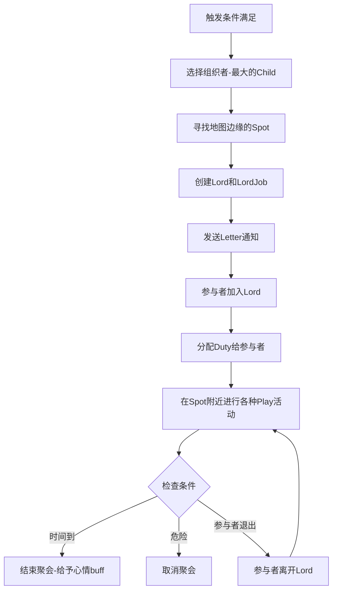

# 儿童野游系统设计文档

本文档描述了RimTalk Toddlers Expansion中的两个野游功能的设计和实现细节。

**实现状态**: ✅ 已完成基础实现

## 概述

系统分为两个独立的功能：
1. **跟随野游 (Follow Nature Running)** - ✅ 已实现 - 简单Job系统，当Child野游时其他儿童跟随
2. **聚会野游 (Children Gathering Outing)** - ✅ 已实现 - 完整Lord系统，模仿原版Party

---

## 功能1: 跟随野游 (Follow Nature Running)

### 设计目标
当一个Child开始原版的NatureRunning（自然野游）时，附近10格内的其他Child和Toddler会自动跟随他一起野游。

### 核心机制



### 实现的文件

```
Defs/
  JobDefs/
    Jobs_FollowNatureRunner.xml      # JobDef定义 ✅
Source/
  Integration/Toddlers/
    JobDriver_FollowNatureRunner.cs  # Job驱动逻辑 ✅
  Harmony/
    Patch_LearningGiver_NatureRunning.cs  # 监听野游开始并招募跟随者 ✅
Languages/
  English/Keyed/
    FollowNatureRunner.xml           # 英文本地化 ✅
  ChineseSimplified/Keyed/
    FollowNatureRunner.xml           # 中文本地化 ✅
```

### 核心类设计

#### JobDriver_FollowNatureRunner
复用 `JobDriver_Workwatching` 的跟随逻辑：

```csharp
public class JobDriver_FollowNatureRunner : JobDriver
{
    private const int FollowDistance = 5;  // 跟随距离
    private const float HungerThreshold = 0.1f;  // 饥饿阈值
    private const float RestThreshold = 0.1f;   // 困倦阈值
    
    private Pawn LeaderToFollow => (Pawn)TargetThingA;
    
    // 检查领队是否仍在野游
    private bool LeaderStillNatureRunning()
    {
        return LeaderToFollow.CurJobDef == ToddlersExpansionJobDefOf.NatureRunning;
    }
    
    // 检查是否需要退出
    private bool ShouldExitFollowing()
    {
        // 饥饿检查
        if (pawn.needs?.food?.CurLevelPercentage < HungerThreshold)
            return true;
        // 困倦检查
        if (pawn.needs?.rest?.CurLevelPercentage < RestThreshold)
            return true;
        // 领队检查
        if (!LeaderStillNatureRunning())
            return true;
        return false;
    }
}
```

#### Harmony Patch
监听NatureRunning Job开始并招募跟随者：

```csharp
[HarmonyPatch(typeof(Pawn_JobTracker), nameof(Pawn_JobTracker.StartJob))]
public static class Patch_NatureRunning_Recruit
{
    public static void Postfix(Pawn_JobTracker __instance, Job newJob)
    {
        if (newJob?.def != ToddlersExpansionJobDefOf.NatureRunning)
            return;
            
        Pawn leader = __instance.pawn;
        if (!leader.DevelopmentalStage.Child())
            return;
            
        // 招募10格内的其他儿童
        RecruitNearbyChildren(leader);
    }
}
```

### ThinkNode 集成

为了确保Toddler的跟随行为不被Toddlers mod的AI覆盖，需要：
1. 在ThinkTree中添加高优先级的检查节点
2. 或者使用类似于观察成人工作的机制

---

## 功能2: 聚会野游 (Children Gathering Outing)

### 设计目标
完全模仿原版Party聚会系统，组织所有Child和Toddler去地图边缘进行户外聚会。

### 核心机制



### 实现的文件

```
Defs/
  GatheringDefs/
    Gatherings_ChildrenOuting.xml    # GatheringDef ✅
  DutyDefs/
    Duties_ChildrenOuting.xml        # DutyDef ✅
  ThoughtDefs/
    Thoughts_ChildrenOuting.xml      # 心情buff ✅
Source/
  Integration/Toddlers/
    LordJob_ChildrenOuting.cs        # Lord任务 ✅
    LordToil_ChildrenOuting.cs       # Lord状态 ✅
    GatheringWorker_ChildrenOuting.cs # 聚会工作者 ✅
    JobGiver_ChildrenOutingPlay.cs   # 分配play job ✅
Source/Core/
    DefOfs.cs                        # 添加了新的ThoughtDef引用 ✅
Languages/
  English/
    Keyed/ChildrenOuting.xml         # 英文本地化 ✅
    DefInjected/ThoughtDef/Thoughts_ChildrenOuting.xml ✅
  ChineseSimplified/
    Keyed/ChildrenOuting.xml         # 中文本地化 ✅
    DefInjected/ThoughtDef/Thoughts_ChildrenOuting.xml ✅
```

### XML 定义

#### GatheringDef

```xml
<GatheringDef>
  <defName>RimTalk_ChildrenOuting</defName>
  <label>children's outing</label>
  <randomSelectionWeight>0.5</randomSelectionWeight>
  <letterTitle>Children's Outing</letterTitle>
  <letterText>The children are going on an outing! They will explore the map edge and play together.</letterText>
  <calledOffMessage>The children's outing has been called off.</calledOffMessage>
  <finishedMessage>The children's outing has finished.</finishedMessage>
  <duty>RimTalk_ChildrenOuting</duty>
  <workerClass>RimTalk_ToddlersExpansion.GatheringWorker_ChildrenOuting</workerClass>
</GatheringDef>
```

#### DutyDef

```xml
<DutyDef>
  <defName>RimTalk_ChildrenOuting</defName>
  <label>children outing</label>
  <hook>MediumPriority</hook>
  <thinkNode Class="ThinkNode_Priority">
    <subNodes>
      <li Class="ThinkNode_ConditionalInGatheringArea">
        <subNodes>
          <!-- 随机选择一种play活动 -->
          <li Class="ThinkNode_ConditionalRandom">
            <chance>0.2</chance>
            <subNodes>
              <li Class="RimTalk_ToddlersExpansion.JobGiver_ChildrenOutingPlay" />
            </subNodes>
          </li>
          
          <!-- 站立并社交 -->
          <li Class="ThinkNode_ConditionalRandom">
            <chance>0.3</chance>
            <subNodes>
              <li Class="JobGiver_StandAndBeSociallyActive">
                <ticksRange>350~750</ticksRange>
              </li>
            </subNodes>
          </li>
          
          <!-- 闲逛 -->
          <li Class="JobGiver_WanderInGatheringArea">
            <ticksBetweenWandersRange>50~250</ticksBetweenWandersRange>
          </li>
        </subNodes>
      </li>
      
      <!-- 前往聚会区域 -->
      <li Class="JobGiver_WanderInGatheringArea">
        <ticksBetweenWandersRange>50~250</ticksBetweenWandersRange>
        <locomotionUrgency>Jog</locomotionUrgency>
      </li>
    </subNodes>
  </thinkNode>
</DutyDef>
```

### 核心类设计

#### LordJob_ChildrenOuting

```csharp
public class LordJob_ChildrenOuting : LordJob_Joinable_Gathering
{
    protected override ThoughtDef AttendeeThought => RimTalkDefOf.RimTalk_AttendedChildrenOuting;
    
    public LordJob_ChildrenOuting(IntVec3 spot, Pawn organizer, GatheringDef gatheringDef)
        : base(spot, organizer, gatheringDef)
    {
        // 持续时间: 5000-15000 ticks (约2-6分钟游戏时间)
        durationTicks = Rand.RangeInclusive(5000, 15000);
    }
    
    public override float VoluntaryJoinPriorityFor(Pawn p)
    {
        // 只有Child和Toddler可以参加
        if (!IsChildOrToddler(p))
            return 0f;
            
        // 检查饥饿和困倦
        if (!ShouldPawnKeepOuting(p))
            return 0f;
            
        return VoluntarilyJoinableLordJobJoinPriorities.SocialGathering;
    }
    
    private bool IsChildOrToddler(Pawn p)
    {
        return p.DevelopmentalStage == DevelopmentalStage.Child ||
               p.DevelopmentalStage == DevelopmentalStage.Baby;
    }
    
    private bool ShouldPawnKeepOuting(Pawn p)
    {
        // 饥饿<10%
        if (p.needs?.food?.CurLevelPercentage < 0.1f)
            return false;
        // 困倦<10%
        if (p.needs?.rest?.CurLevelPercentage < 0.1f)
            return false;
        return true;
    }
}
```

#### GatheringWorker_ChildrenOuting

```csharp
public class GatheringWorker_ChildrenOuting : GatheringWorker
{
    protected override bool TryFindGatherSpot(Pawn organizer, out IntVec3 spot)
    {
        // 寻找地图边缘附近的有趣位置
        return TryFindMapEdgeSpot(organizer.Map, out spot);
    }
    
    protected override Pawn FindOrganizer(Map map)
    {
        // 找到最大的Child作为组织者
        return map.mapPawns.FreeColonistsSpawned
            .Where(p => p.DevelopmentalStage.Child() && 
                       GatheringsUtility.PawnCanStartOrContinueGathering(p))
            .OrderByDescending(p => p.ageTracker.AgeBiologicalYears)
            .FirstOrDefault();
    }
    
    private bool TryFindMapEdgeSpot(Map map, out IntVec3 spot)
    {
        // 寻找安全的地图边缘位置
        // 优先选择有植物、水源等自然景观的位置
    }
}
```

#### JobGiver_ChildrenOutingPlay

```csharp
public class JobGiver_ChildrenOutingPlay : ThinkNode_JobGiver
{
    // 可用的Play活动列表
    private static readonly List<JobDef> playJobs = new List<JobDef>
    {
        // Toddlers mod的play
        ToddlersDefOf.ToddlerFloordrawing,
        ToddlersDefOf.ToddlerSkydreaming,
        ToddlersDefOf.ToddlerBugwatching,
        // RimTalk的play
        RimTalkDefOf.RimTalk_ToddlerSelfPlayJob,
        RimTalkDefOf.RimTalk_ToddlerMutualPlayJob,
    };
    
    protected override Job TryGiveJob(Pawn pawn)
    {
        // 随机选择一种play活动
        JobDef selectedJob = playJobs.RandomElement();
        return JobMaker.MakeJob(selectedJob);
    }
}
```

### 参与者退出机制

```csharp
// 在 LordToil_ChildrenOuting 中检查
public override void LordToilTick()
{
    base.LordToilTick();
    
    // 每60 ticks检查一次
    if (Find.TickManager.TicksGame % 60 != 0)
        return;
        
    for (int i = lord.ownedPawns.Count - 1; i >= 0; i--)
    {
        Pawn p = lord.ownedPawns[i];
        
        // 饥饿检查
        if (p.needs?.food?.CurLevelPercentage < 0.1f)
        {
            lord.Notify_PawnLost(p, PawnLostCondition.LeftVoluntarily);
            continue;
        }
        
        // 困倦检查
        if (p.needs?.rest?.CurLevelPercentage < 0.1f)
        {
            lord.Notify_PawnLost(p, PawnLostCondition.LeftVoluntarily);
            continue;
        }
    }
}
```

---

## 实现优先级

1. **功能1: 跟随野游** - 相对简单，可以先实现
   - 复用现有的JobDriver逻辑
   - 主要工作是Harmony Patch

2. **功能2: 聚会野游** - 较复杂，需要更多时间
   - 需要创建完整的Lord系统
   - 需要创建多个Def文件

3. **清理旧系统** - 在新系统完成后进行
   - 保留可复用的代码
   - 删除不再需要的文件

---

## Debug Actions

在开发模式下可用的调试命令：

1. **Force child to nature run** - 强制选中的儿童开始野游，附近的其他儿童会自动跟随
2. **Start children gathering outing** - 自动寻找组织者并启动儿童野游聚会
3. **Start children outing (selected organizer)** - 以选中的儿童作为组织者启动野游聚会
4. **Show active lords** - 显示所有活动中的Lord及其参与者
5. **Show follow nature runner status** - 显示当前的野游和跟随状态

## 与Toddlers mod的兼容性

### 挑战
Toddlers mod有自己的ThinkTree和AI系统，可能会覆盖我们的Job。

### 解决方案

1. **跟随野游**: 通过Harmony patch在NatureRunning Job开始时立即招募跟随者，使用`JobCondition.InterruptForced`强制覆盖当前job

2. **聚会野游**: Lord系统的Duty机制本身就有较高优先级(MediumPriority hook)，应该不会被轻易覆盖

### 验证要点
- 测试Toddler是否能正确参与两种野游
- 测试退出条件是否正常工作
- 测试存档/读档后状态是否保持

## 注意事项

1. **旧系统保留**: 原有的ToddlerOuting系统(JobDriver_ToddlerOuting, ToddlerOutingSession等)暂时保留，可能在后续版本中清理

2. **触发条件**: 聚会野游目前需要通过Debug Actions手动触发，后续可以添加自动触发机制(如定期随机触发)

3. **参与者限制**: 聚会野游仅限Child和Toddler参与，不会邀请成年人